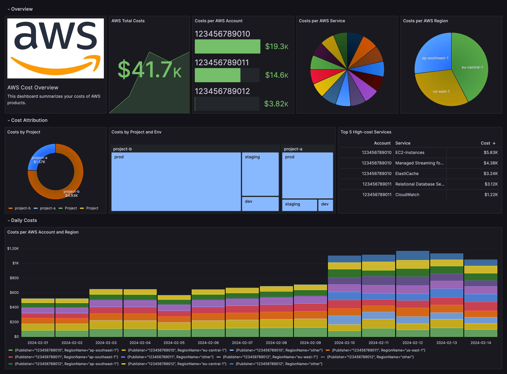
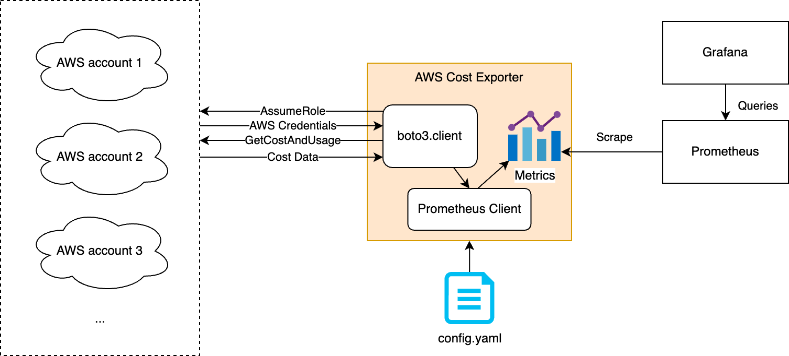

# AWS Cost Exporter

Cloud providers like AWS and Azure usually provide cost management portals, dashboards, and APIs for their own products. If a user has a multi-cloud environment, she needs to check the cost information in different places.

This AWS Cost Metrics Exporter helps users to fetch AWS cost information using AWS Cost Explorer APIs and exposes them as standard Prometheus metrics. This enables users to have cost-related metrics present in the same place where their business metrics are. The design also makes it possible to collect cost data from different providers and design one single dashboard for all the costs.

## Example of Dashboard on Grafana


_This is just an example with fake data that shows the idea of visualizing AWS cost metrics exported by this tool. You can find a simplified version of this dashboard in json [here](doc/aws-cost-overview-dashboard-example.json)._

## Sample Output

```
# HELP aws_daily_cost_usd Daily cost of an AWS account in USD
# TYPE aws_daily_cost_usd gauge
aws_daily_cost_usd{ChargeType="Usage",EnvironmentName="sandbox",ProjectName="myproject",Publisher="<aws_account_1>",RegionName="eu-central-1"} 10.1827240691
aws_daily_cost_usd{ChargeType="Usage",EnvironmentName="sandbox",ProjectName="myproject",Publisher="<aws_account_1>",RegionName="other"} 4.258201088100001
aws_daily_cost_usd{ChargeType="Usage",EnvironmentName="prod",ProjectName="myproject",Publisher="<aws_account_2>",RegionName="eu-central-1"} 68.6121380948
aws_daily_cost_usd{ChargeType="Usage",EnvironmentName="prod",ProjectName="myproject",Publisher="<aws_account_2>",RegionName="other"} 2.6191806712
...
```

_ps: As the metric name indicate, the metric shows the daily costs in USD. `Daily` is based a fixed 24h time window, from UTC 00:00 to UTC 24:00. `EnvironmentName` and `ProjectName` are the custom labels that can be configured. `RegionName` is a label based on `group_by` configuration._

## Supported Granularities

The exporter supports different granularities for cost metrics:

- **DAILY**: Exports the cost for the previous day.
- **MONTHLY**: Exports month-to-date costs (from the first day of the current month to now).

You can specify the granularity for each metric in the `exporter_config.yaml` file:

```yaml
metrics:
  - metric_name: aws_daily_cost_usd
    metric_description: Daily AWS Usage Cost
    granularity: DAILY  # Valid values: DAILY, MONTHLY
    data_delay_days: 0  # Optional. Query N days in arrears (useful for eventual consistency, e.g. Savings Plans amortization)
    # ... other configurations
```

## How Does This Work

AWS Cost Metrics Exporter fetches cost data from a list of AWS accounts, each of which provides a necessary IAM role for the exporter. It regularly queries the AWS [GetCostAndUsage](https://docs.aws.amazon.com/aws-cost-management/latest/APIReference/API_GetCostAndUsage.html) to get the whole AWS account's cost. It is configurable to have different queries, such as group by services and tags, merge minor cost to one single category, etc. The following figure describes how AWS Cost Metrics Exporter works.



## How Does Exporter Use AWS Credentials
This exporter is implemented with [AWS Boto3 SDK](https://boto3.amazonaws.com/v1/documentation/api/latest/index.html) and it follows the order in which Boto3 searches for credentials (see the official docs [here](https://boto3.amazonaws.com/v1/documentation/api/latest/guide/credentials.html#configuring-credentials)). The only difference is that, when `aws_access_key` and `aws_secret_key` are defined in the `exporter_config.yaml` file, the exporter will use these credentials and authenticate as an IAM user.

## Setup AWS IAM User, Role, and Policy

Note that if there is a list of AWS accounts for cost data collection, only **ONE** user needs to be created. This user is usually created in the AWS account where the exporter is deployed (an EKS cluster). This can be done from the AWS console - IAM portal or by terraform code.

After creating the user, visit the security credentials tab and create an access key for it. The access key and secret key will be needed when deploying the exporter.

For each target AWS account, a role for AWS Cost Metrics Exporter needs to be created. The name of this role needs to be put into the configuration file (`aws_assumed_role_name`).

Regarding the permissions, the role should at least have the following inline policy.

```
{
    "Statement": [
        {
            "Action": "ce:GetCostAndUsage",
            "Effect": "Allow",
            "Resource": "*",
            "Sid": ""
        }
    ],
    "Version": "2012-10-17"
}
```

Under the trust relationships tab, add the following policy to it (add the ARN of the created user to `<arn_of_the_cretaed_user>`, the correct format should be `arn:aws:iam::xxxxxxxxxxxx:user/username`):

```
{
    "Version": "2012-10-17",
    "Statement": [
        {
            "Sid": "",
            "Effect": "Allow",
            "Principal": {
                "AWS": [
                    "<arn_of_the_cretaed_user>"
                ]
            },
            "Action": "sts:AssumeRole"
        }
    ]
}
```

## Deployment

Modify the `exporter_config.yaml` file first, then use one of the following methods to run the exporter.

### Docker

```
docker run --rm -v ./exporter_config.yaml:/app/exporter_config.yaml -p 9090:9090 -e AWS_ACCESS_KEY=${AWS_ACCESS_KEY} -e AWS_ACCESS_SECRET=${AWS_ACCESS_SECRET} opensourceelectrolux/aws-cost-exporter:v1.1.3
```

### Kubernetes

- Create Namespace

```
kubectl create ns finops
```

- Create Secret

```
kubectl create secret generic aws-cost-exporter \
    --namespace=finops \
    --from-literal=aws_access_key='${AWS_ACCESS_KEY}' \
    --from-literal=aws_access_secret='${AWS_ACCESS_SECRET}'
```

- Create ConfigMap

```
kubectl create configmap aws-cost-exporter-config --namespace finops --from-file=./exporter_config.yaml
```

- Create Deployment

```
kubectl create --namespace finops -f ./deployment/k8s/deployment.yaml
```
